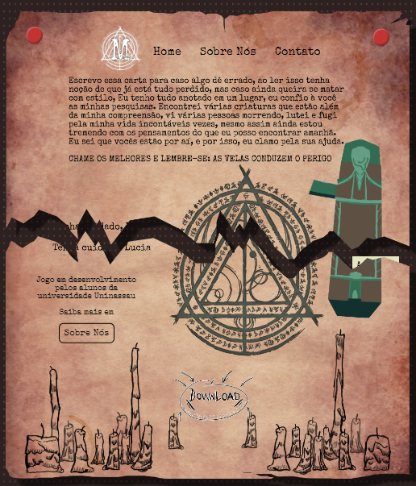
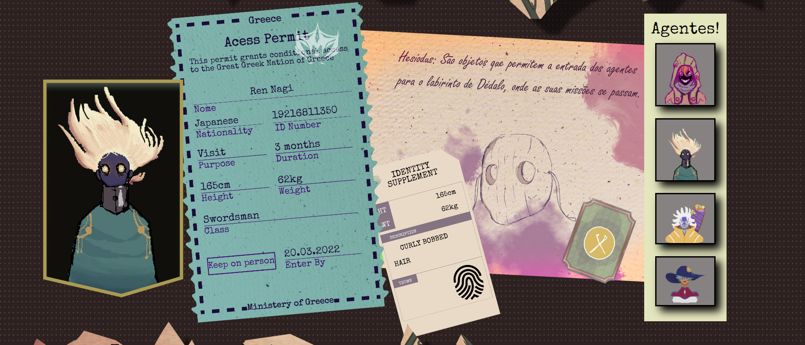
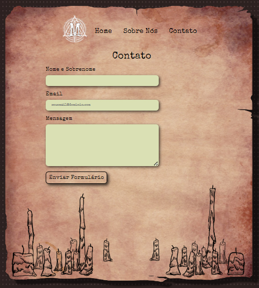

# BigCrunch

Um jogo que está sendo desenvolvido pelos alunos da universidade Uninassau.
O jogo se passa na Grécia em um hotel que foi tomado por um culto que idolatra o paranormal, você jogará com alguns agentes e descubrirá mais sobre a história por trás dos mistérios!

# Alunos

- Gabriel Barbosa - 01566611
- Pedro Augusto - 0143875
- Marcos Antônio - 01405752
- Gabriel Pacheco - 01427378
- George José - 01430653
- Israel Viegas - 01433868

## 📱Funcionalidades do Projeto
  
  - [x] Enviar Email

 ## 🖥️Layout
   
   
   
   
##  Site do projeto?
https://georgejcs.github.io/BigCrunch/
  

